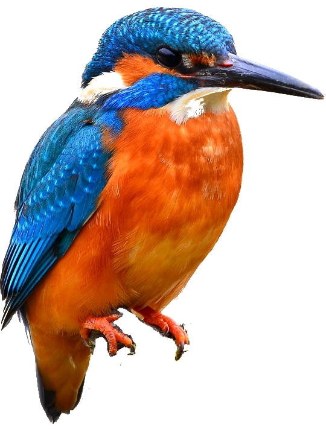

## Laying out Images and Fonts in ggplot with colour extraction too

```{r setup, include=FALSE}
knitr::opts_chunk$set(echo = FALSE, message = FALSE, warnings = FALSE)

# Whether to download originals from wikipedia
downloadOriginals = TRUE
# Whether to get palettes (takes a c. 35 seconds) 
getPalettes = TRUE

# Load packages
pacman::p_load(tidyverse, colorfindr, magick, ggforce, ggtext, ggtextures, here, tools, janitor, kable)
# devtools::install_github("clauswilke/ggtextures")

# Load helper functions
source(here::here("src", "r_functions","imageProcessing.R"))

# Set project directory defaults
dataDir <- here::here("data")
outputDir <- here::here("output")
```

## The Challenge

To create a complete data visualisation using ggplot, i.e. without the need to add any finishing touches with a package such as Illustrator.  To include specific fonts, cropped images and a repeating pattern where each item has similar constituent parts.

To make it a bit more interesting, I wanted to use R to extract colours from the included images.

## Packages
I used the following R packages:
```{r getPackages}
packages = data.frame(
  Package = c("tidyverse", "colorfindr", "magick", "ggforce", "ggtext", "ggtextures", "here", "tools", "janitor", "kable"),
  For = c("All kinds of stuff including ggplot used for making the final plot", "Extracting the colour palettes", "Cropping and resizing the bird images", "Plotting palette circles in specific places", "Adding rich text (with fonts) to ggplot", "Places images without distortion based on the device aspect ratio or scales", "Great for easily getting hold of files in your project structure without hardcoding underlying folders", "Removing the extension from a file name so that I can add .png", "Cleaning up column names in bird file", "Displaying tables like this one")
)

knitr::kable(packages)
```

## Subject Matter - My British Birds
I chose eight birds that I either see in my garden or in the case of my favorite, the Kingfisher, nearby.  I used images from Wikipedia.  The birds and accreditations are listed below.

```{r getBirdData}
# Read bird data
birds <- data.frame(read_csv(file.path(dataDir,"birds.csv"))) %>%
  clean_names("lower_camel") %>%
  filter(include == "Y") %>%
  mutate(croppedImage = "", fileName = "",
         imageID = row_number())

knitr::kable(birds %>% select(name, scientificName, ukConservationStatus, whatTheyEat, imageCredit),
             col.names = c("Name", "Scientific Name", "Conservation Status", "What they eat", "Image Credit"))
```

```{r downloadAndCrop}
# Download and crop images and get palettes as required for each bird
for(row in 1:nrow(birds)) {
  imageURL <- as.character(birds[[row, "imageUrl"]])
  xOffset <- as.integer(birds[[row, "xoffset"]])
  yOffset <- as.integer(birds[[row, "yoffset"]])
  zoom <- as.numeric(birds[[row, "zoom"]])
  # Get filename portion of path
  fileName <- basename(imageURL)
  birds[[row, "fileName"]] <- fileName
  # Download and crop image if required
  if (downloadOriginals) {
    downloadAndCropImage(imageURL, fileName, xOffset, yOffset, zoom, outputDir)  
  }
  # Store path of circular cropped image in data frame
  birds[[row, "croppedImage"]] <- file.path(outputDir, "images", "cropped", fileName)
}
```
## Extracting Colour Palette
The colorfindr package includes a get_colors function that does just that. 

The bird images include backgrounds, branches, leaves, tree bark etc and I didn't want to include those colours in my palettes.  So I created rough crops of each image and placed them in the data/images/handcropped folder (not the output folder as these are not programatically created).

I selected the top 6 colours as in the example below.

```{r, out.width="20%", fig.cap="English Common Kingfisher", fig.align="center"}

```
```{r getColoursExample, fig.width=8, fig.height=3, echo = TRUE}
palette <- colorfindr::get_colors(here::here(dataDir, "images", "handCropped", "Eisvogel_kingfisher.png"), 
                      exclude_col = "#FFFFFF", exclude_rad = 10
                      ) %>% 
  make_palette(n = 6)
```

## Cropping, zooming and centering
Rectangular images don't look good in this context, so I wanted to apply a circular crop.  The images were also of varying sizes and in some cases, such as our Kingfisher, the hero was not in the middle.

I added specific adjustments for zoom, x and y offsets to the bird table which I could then apply.
```{r, out.width="20%", fig.cap="Original", fig.align="center"}
knitr::include_graphics("output/images/originals/Eisvogel_kingfisher.jpg")
```
```{r, out.width="20%", fig.cap="Cropped, zoomed and centered", fig.align="center"}
knitr::include_graphics("output/images/cropped/Eisvogel_kingfisher.jpg")
```

```{r getPalettes}
# Create empty data frame of colours for calculation or reading from file
imageColours <- data.frame(imageID = integer(), colourID = integer(), name = character(), colour = character()) 

if (getPalettes) {
  # Get image palettes if required
  for(row in 1:nrow(birds)) {
    name <- as.character(birds[[row, "name"]])
    #imageURL <- as.character(birds[[row, "ImageURL"]])
    fileName <- as.character(birds[[row, "fileName"]])
    # Get filename portion of path and replace extension with png
    pngFileName <- pngExtension(fileName)
    palette <- getPalette(pngFileName, dataDir)
    for(colour in 1:length(palette)) {
      imageColourRow <- data.frame(imageID = row, colourID = colour, name = name, colour = palette[colour]) 
      imageColours <- rbind(imageColours, imageColourRow)
    }
  }
  # Save palettes if we've just got them, or load them if not
  saveRDS(imageColours, file.path(outputDir, "imageColours.RDS"))
} else {
  imageColours = readRDS(file.path(outputDir, "imageColours.RDS"))
}

```

## And here is the final plot

```{r plot, width = 23, height = 10}
# Create Plot
# See
# https://rdrr.io/github/clauswilke/ggtextures/man/geom_textured_rect.html
# https://stackoverflow.com/questions/66187244/maintaining-aspect-ratio-of-shapes-and-images-in-ggplot-ggimage?noredirect=1#comment117027818_66187244

# Calculate coordinate bases for each bird's image and colour palettes
positionX <- function(id) {
  return (((id -1) %% 4) * 32 + 4)
}
positionY <- function(id) {
  return (floor((id - 1) / 4) * 40 + 6)
}

g <- ggplot()  +
  # Birds are plotted within rectangles 'textured' with the image
  ggtextures::geom_textured_rect(data = birds, 
                                     aes(xmin = positionX(imageID), xmax = positionX(imageID) + 20,
                                         ymin = positionY(imageID), ymax = positionY(imageID) + 20, image = croppedImage), 
                                     lty = "blank", # line type of blank to remove border
                                     fill="white", # used to fill transparent areas of image
                                     nrow = 1,
                                     ncol = 1,
                                     img_width = unit(1, "null"),
                                     img_height = unit(1, "null"),
                                     position = "identity") +
  xlim(0, 124) + ylim(0, 80) +
  coord_equal() +# A fixed scale coordinate system forces a specified ratio between the physical representation of data units on the axes. 
  ggtext::geom_richtext(data = birds, aes(label = name,
                                        x = positionX(imageID) + 10, y = positionY(imageID) + 28),
                hjust = 0.5, vjust = 0, label.size = 0, size = 7, family = "Snell Roundhand") +
  ggtext::geom_richtext(data = birds, aes(label = paste0(scientificName, "<br>", order, "<br>", family),
                                        x = positionX(imageID) + 10, y = positionY(imageID) + 28),
                hjust = 0.5, vjust = 1, label.size = 0, size = 4, family = "Dosis") +
  
  theme_void() +
  theme(
    text = element_text(family = "Dosis"),
    plot.title.position = "plot",
    plot.title = ggtext::element_markdown(size = 16, lineheight = 1.5),
    plot.margin = unit(c(0.5,0.5,0.5,0.5), "cm") # top, right, bottom, left
  ) +
  labs(
    title = "<span style = 'font-size:36pt; font-family:SnellRoundhand;'>The Colours of my British Birds</span><br>
<span style = 'color:#3D4849;'>&nbsp;&nbsp;&nbsp;... birds in my garden or nearby</span>",
    caption = "(c) 2021 Chris Woods.  Images from Wikipedia.  For full details and accreditations see https://github.com/ChrisWoodsSays/bird_colours")

# Plot palette colours
g <- g + ggforce::geom_circle(data = imageColours, 
            aes(x0 = positionX(imageID) + colourID * 4 - 4, y0 = positionY(imageID) - 3, r = 2, fill = colour), 
            color = "transparent", show.legend=FALSE) +
  scale_fill_identity() # sets colour to hex value +

# Save File
ggsave("MyBritishBirds.png", g, path = file.path(outputDir, "images"),device = "png", dpi=300, width = 29.7, height = 21, units = "cm")

```

`)
