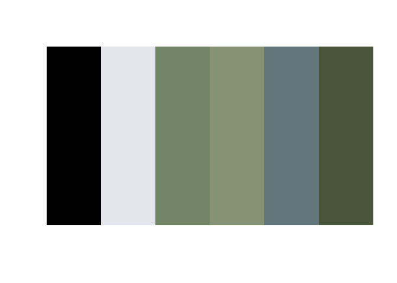

The Colours of my British Birds
================

Laying out images and fonts in ggplot with colour extraction too.

@ChrisWoodsSays, 2.3.2021

## The Challenge

To create a complete data visualisation using ggplot, i.e. without the
need to add any finishing touches with a package such as Illustrator. To
include specific fonts, cropped images and a repeating pattern where
each item has similar constituent parts.

To make it a bit more interesting, I wanted to use R to extract colours
from the included images.

## Packages

I used the following R packages:

| Package    | For                                                                                                    |
|:-----------|:-------------------------------------------------------------------------------------------------------|
| tidyverse  | All kinds of stuff including ggplot used for making the final plot                                     |
| colorfindr | Extracting the colour palettes                                                                         |
| magick     | Cropping and resizing the bird images                                                                  |
| ggforce    | Plotting palette circles in specific places                                                            |
| ggtext     | Adding rich text (with fonts) to ggplot                                                                |
| ggtextures | Places images without distortion based on the device aspect ratio or scales                            |
| here       | Great for easily getting hold of files in your project structure without hardcoding underlying folders |
| tools      | Removing the extension from a file name so that I can add .png                                         |
| janitor    | Cleaning up column names in bird file                                                                  |
| kable      | Displaying tables like this one                                                                        |

## Subject Matter - My British Birds

I chose eight birds that I either see in my garden or in the case of my
favorite, the Kingfisher, nearby. I used images from Wikipedia. The
birds and accreditations are listed below.

| Name                                                                                        | Scientific Name     | Conservation Status | What they eat                                                                                                 | Image Credit                                                                                                               |
|:--------------------------------------------------------------------------------------------|:--------------------|:--------------------|:--------------------------------------------------------------------------------------------------------------|:---------------------------------------------------------------------------------------------------------------------------|
| [Kingfisher](https://commons.wikimedia.org/wiki/File:Eisvogel_kingfisher.jpg)               | Alcedo atthis       | Amber               | Fish and aquatic insects                                                                                      | Frank-2.0, CC0, via Wikimedia Commons                                                                                      |
| [Robin](https://commons.wikimedia.org/wiki/File:Erithacus_rubecula_with_cocked_head.jpg)    | Erithacus rubecula  | Green               | Worms, seeds, fruits, insects and other invertebrates                                                         | © Francis C. Franklin / CC-BY-SA-3.0, CC BY-SA 3.0 <https://creativecommons.org/licenses/by-sa/3.0>, via Wikimedia Commons |
| [Goldfinch](https://commons.wikimedia.org/wiki/File:Carduelis_carduelis_close_up.jpg)       | Carduelis carduelis | Green               | Seeds and insects in summer.                                                                                  | © Francis C. Franklin / CC-BY-SA-3.0, CC BY-SA 3.0 <https://creativecommons.org/licenses/by-sa/3.0>, via Wikimedia Commons |
| [Nuthatch](https://commons.wikimedia.org/wiki/File:Sitta_europaea_wildlife_2_1.jpg)         | Sitta europaea      | Green               | Insects, hazel nuts, acorns, beechmast and other nuts and seed                                                | Paweł Kuźniar, CC BY-SA 3.0 <http://creativecommons.org/licenses/by-sa/3.0/>, via Wikimedia Commons                        |
| [Blue tit](https://commons.wikimedia.org/wiki/File:Eurasian_blue_tit_Lancashire.jpg)        | Cyanistes caeruleus | Green               | Insects, caterpillars, seeds and nuts.                                                                        | © Francis C. Franklin / CC-BY-SA-3.0, CC BY-SA 3.0 <https://creativecommons.org/licenses/by-sa/3.0>, via Wikimedia Commons |
| [Blackbird](https://commons.wikimedia.org/wiki/File:Common_Blackbird.jpg)                   | Turdus merula       | Green               | Blackbird food consists of a variety of insects and worms, but they also eat berries and fruit when in season | Andreas Trepte, CC BY-SA 2.5 <https://creativecommons.org/licenses/by-sa/2.5>, via Wikimedia Commons                       |
| [Bullfinch](https://commons.wikimedia.org/wiki/File:Bullfinch_male.jpg)                     | Pyrrhula pyrrhula   | Amber               | Seeds, buds and insects (for young).                                                                          | © Francis C. Franklin / CC-BY-SA-3.0, CC BY-SA 3.0 <https://creativecommons.org/licenses/by-sa/3.0>, via Wikimedia Commons |
| [Greater-spotted<br>Woodpecker](https://commons.wikimedia.org/wiki/File:Hackspettshona.jpg) | Dendrocopos major   | Green               | Insects, seeds and nuts                                                                                       | Hangsna, CC BY-SA 4.0 <https://creativecommons.org/licenses/by-sa/4.0>, via Wikimedia Commons                              |

## Extracting Colour Palette

The colorfindr package includes a get\_colors function that does just
that.

The bird images include backgrounds, branches, leaves, tree bark etc and
I didn’t want to include those colours in my palettes. So I created
rough crops of each image and placed them in the data/images/handcropped
folder (not the output folder as these are not programatically created).

I selected the top 6 colours as in the example below.

<div class="figure" style="text-align: center">


<p class="caption">
English Common Kingfisher
</p>

</div>

``` r
palette <- colorfindr::get_colors(here::here(dataDir, "images", "handCropped", "Eisvogel_kingfisher.png"), 
                      exclude_col = "#FFFFFF", exclude_rad = 10
                      ) %>% 
  make_palette(n = 6)
```

<!-- -->

## Cropping, zooming and centering

Rectangular images don’t look good in this context, so I wanted to apply
a circular crop. The images were also of varying sizes and in some
cases, such as our Kingfisher, the hero was not in the middle.

I added specific adjustments for zoom, x and y offsets to the bird table
which I could then apply.

<div class="figure" style="text-align: center">


<p class="caption">
Original
</p>

</div>

<div class="figure" style="text-align: center">


<p class="caption">
Cropped, zoomed and centered
</p>

</div>

<!-- --><!-- --><!-- --><!-- --><!-- --><!-- --><!-- --><!-- -->

## And here is the final plot


